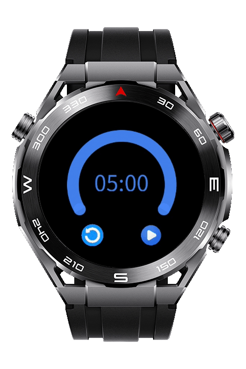
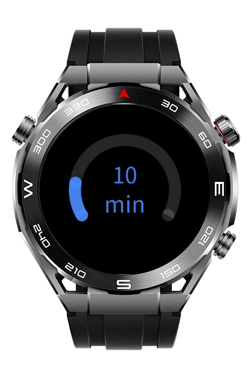
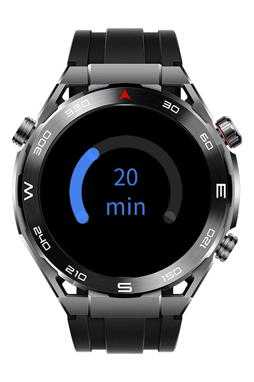
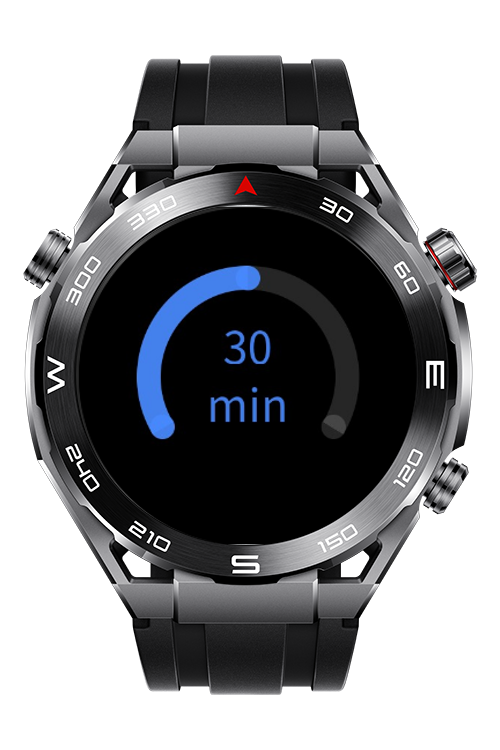

> **Note:** To access all shared projects, get information about environment setup, and view other guides, please visit [Explore-In-HMOS-Wearable Index](https://github.com/Explore-In-HMOS-Wearable/hmos-index).

# Countdown Timer

A sample application demonstrating a touch-based interactive timer. It features a customizable countdown timer with Play/Pause/Reset functionality and a large progress indicator that dynamically shrinks as time runs out.

# Preview
<p align="left">
    
    
    
    
</p>

# Use Cases
* Dynamic Duration Selection: The timer supports 5, 10, 20, 30, and 60 minute/second countdowns.
* Simple Tap Control: Users start or pause the timer with a single tap on the screen.
* Visual Progress Display: A percentage indicator decreases from 100% to 0% to show the remaining time.
* Haptic Feedback Alerts: The app vibrates at the 30-second mark and when the countdown finishes.

# Technology Stack
**Languages**: JS  
**Frameworks**: HarmonyOS SDK 5.0.0(12)  
**Tools**: DevEco Studio 5.1.0  
**Libraries/Kits**: @system.vibrator, @system.router
# Directory Structure
```
entry\src\main\js
└───MainAbility
    │   app.js
    ├───images
    └───pages
        ├───index
        │      index.css
        │      index.hml
        │      index.js
        └───timer
               timer.css
               timer.hml
               timer.js
```

# Constraints and Restrictions

## Supported Device
- Huawei Sport (Lite) Watch GT 4/5/6
- Huawei Sport (Lite) GT4/5 Pro
- Huawei Sport (Lite) Fit 3/4
- Huawei Sport (Lite) D2
- Huawei Sport (Lite) Ultimate

# License

**Timer** is distributed under the terms of the **MIT License**.  
See the [LICENSE](LICENSE) file for more information.  